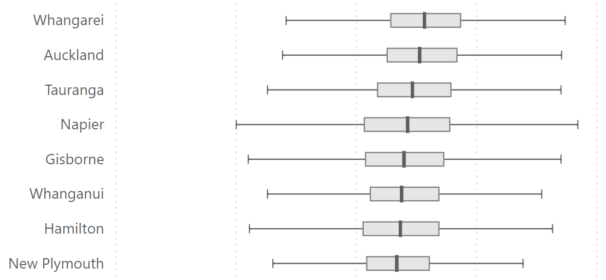

# MacGyver

> [verb] Mac·Gy·ver | mə-ˈgī-vər | MacGyvered | MacGyvering | MacGyvers

&nbsp;

> “Make or repair (an object) in an improvised or inventive way, making use of whatever items are at hand.”
> \- [Merriam-Webster](https://www.merriam-webster.com/wordplay/what-does-macgyver-mean-slang-definition)

> “[Using] the formatting options for Power BI visuals in unorthodox ways to achieve the result we want.”
> \- [Kurt Buhler](https://www.sqlbi.com/articles/creating-custom-visuals-in-power-bi-with-dax/#:~:text=we%20use%20the%20formatting%20options%20for%20Power%20BI%20visuals%20in%20unorthodox%20ways%20to%20achieve%20the%20result%20we%20want)

# Adventures in MacGyvering Power BI Core Visuals

Every now and again, I'll come up with something using core visuals that might be handy for other folks to look at, adapt and make way better than I can. I hope that you find them useful!

## 📎 Box and Whisker Plot (Clustered Bar Chart)

[ [.pbix](./box-whisker-plot-error-bars/box-whisker-plot-error-bars.pbix) ] [ Video Pending ]

This approach uses a clustered bar chart, statistical measures, and error bars to create a layered box and whisker plot. This approach offers the advantage of calculating the statistics over your desired data set rather than the conventional approach of using a custom visual, supplying an index column, and having that visual calculate everything (which can only support a limited dataset).
